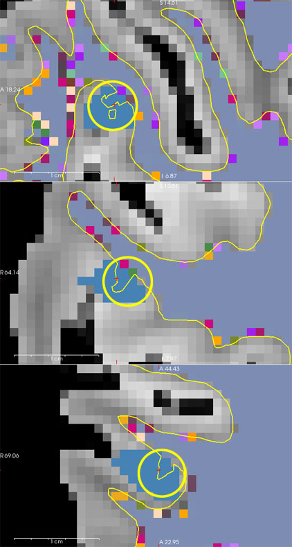

# Surface reconstruction from exvivo MRI
This document describes the steps required to reconstruct the cortical surface from a multi-flash multi-echo acquisition (MGH protocol).

## STEP 0 : edit and run the 00_params.csh script
This file defines the paths used by all subsequent scripts.<br>
It is located in in the **_scripts_templates/** directory

### Edit the script with the following information

* ** Path to the directory containing the DICOM series ($dicom_dir)** <br>
This directory typically contains 2 series per flip angle (FA) (MEFLASH_FA10_0002 and MEFLASH_FA10_0003 for amplitude and phase, respectively). <br>
Each FA series contains one volume per echo, typically 10 echos.<br>
* **Path to the directory containing reconstructions for all subjects ($root_recon_dir/)**
* **Subjects's name ($subj)**, for instance FIBRATLAS_XX-XXX_EXV
* **List of echo times (TE) ($telist)**<br>
    Open one of the flip angle series in Horos (e.g., MEFLASH_FA10_0002); <br>
    This displays 10 volumes, one per echo time.<br>
    For each volume search for the *EchoTime* value in metadata. 

    >In Tours, this is usually : (2.64 4.50 6.36 8.22 10.08 11.94 13.80 15.66 17.52 19.38).

* **Flip Angle values defined by two variables, ($falist_ref1 and $falist_ref2)**<br>
This allows recombination of images acquired in two sessions:<br>
    - $falist_ref1: FA values for the first session<br>
    - $falist_ref2: FA values for the second session<br>
    f only one session was performed, comment out $falist_ref2
    
    > Typical FA values are: 10 20 30 40 50.

### Run the script

```cd _scripts_template ```<br>
``./00_params.csh``<br>
The script creates the following directories if they do not already exist:<br>

```text
$root_recon_dir/
├── mri/ : raw data in mgz format, original orientation
├── rotated/ : data rotated to standard orientation
│   ├── vol2vol/ : rotated raw data (.mgz)
│   ├── split/ : individual TE volumes, rotated
│   └── parameter_maps/ : T1, T2*, PD maps, rotated
└── scripts/ : reconstruction scripts (automatically copied here)
```
These directories will be populated in the next steps.

## STEP 1 : convert DICOM files to mgz format.

Make sure you are in the **< subject >/script/** directory before running :<br>
```./01_convert_MEFLASH_dicom_toMGZ.tcsh```

This script converts the original DICOM to *.mgz* format, and stores the results in the **mri/** directory:<br /> 

* One *.mgz* file is created per FA, 
* Each *.mgz* file contains the 10 echos.<br />

The script looks for a file matching the pattern: ***.????.0001.*.IMA** 

For example, **MEFLASH_FA10_0002/FIBRATLAS_01-14.MR.PROTOCOLES_INSTITUTIONNELS_FIBRATLAS.0002.0001.2021.02.09.15.46.09.318041.70332665.IMA**
Where:
```
- * corresponds to MEFLASH_FA10_0002/FIBRATLAS_01-14.MR.PROTOCOLES_INSTITUTIONNELS_FIBRATLAS
- ???? corresponds to 0002 (series #2)
- *.IMA corresponds to .2021.02.09.15.46.09.318041.70332665.IMA
```
## STEP 2: Rotate volumes and split echoes
### Rotate one volume
* Before running the script, open one volume from **< subject >/mri/** in Freeview
* Select the first volume of a given flip angle (amplitude) as the second contains phase information.

Example:
```
cd < subject >/mri/
freeview MEFLASH_FA30_00??.mgz $FREESURFER_HOME/average/mni305.cor.mgz:colormap=heat:opacity=0.5
```
his overlays the volume onto an average brain to determine the correct orientation.

> Ensure that the selected volume is the acquisition to rotate, not the atlas!

* In Freeview, use **Tools > Transform volume** to adjust orientation
(rotation only: no scaling or translation):

    - Usually about 80° for X, no rotation for Y, 180° for Z
    - Beware the Right-Left orientation: In axial view, **the letters shown at the bottom of the view should appear on the left side of the image and appear flipped.**
    - Save the volumes in **mri/** as **rotation_template.mgz*** (this name can be changed in **00_params.csh**)
    - This produces the reoriented volume (**rotation_template.mgz**) and the related transformation (**rotation_template.mgz.lta**)


### Run the script
```
cd <subject>/scripts/
02_rotate_split.csh
```
This script :

* Creates a rotated file per FA in **mri/rotated/vol2vol/** aligned to **rotation_template.mgz**,
> Uses only the amplitude images (phase is ignored)
* Splits each rotated FA volume into 10 echo volumes in **rotated/split/**, 
> for instance MEFLASH_FA10_0002.rot0000.mgz to MEFLASH_FA10_0002.rot0009.mgz.
* FAssigns the correct TE value to each echo. 
* Compute **flash 10-50, PD, T1, SSE, T2** maps usin Bloch's equations. Results are saved in **rotated/parameter_maps/**.

## STEP 3 : Create and apply masks
### Determine threshold values
```
cd <subject>/rotated/parameter_maps/
freeview PD.mgz T1.mgz T2star.mgz
```

* In Freeview, use **Tools > Threshold volume** to determine:
    * *PDThresh* : minimum value in **PD.mgz** to include brain and fluid while excluding air and the container,
    > Produces **PD.th.ocn.mgz** by keeping only voxels above *PDThresh* (brain and fluid) and belonging to a cluster > 4000 voxels
    * *T2sThresh*: maximum value in **T2star.mgz** for voxels belonging to brain air 
    > Produces **T2s.th.ocn.mgz** by keeping only voxels below *T2sThresh* (brain and air) and belonging to a cluster > 4000 voxels
    * *T1Thresh* : minimum value in **T1.mgz** for voxels belonging to fluid


|               |In             | Out         | Filename      |
| ------------- | ------------- | ----------- | ------------- |
| i > PDThresh  | Brain + Fluid | Air + Box   |PD.th.ocn.mgz  |
| i < T2sThresh | Brain + Air   | Fluid       |T2s.th.ocn.mgz |
| i > T1Thresh  | Fluid 	    | Brain + Air |T2s.th.ocn.mgz |

Edit these values into **03_create_masks.csh**

### Run the script
```
cd <subject>/scripts/
03_create_masks.csh
```
### Check the output
```
cd <subject>/rotated/parameter_maps
freeview PD.mgz brainmask.bb.mgz:colormap=heat:opacity=0.3  PD.bb.maskedn.conf+noise.gstd1abs.mgz:colormap=jet:opacity=0.3 
```

* Verify that **brainmask.bb.mgz** and  **PD.bb.maskedn.conf+noise.gstd1abs.mgz** contain the whole brain and only brain voxels.
> If not, adjust the thresholds and rerun the script, you may run individual commands  to to fine-tune values.

```
cd <subject>/rotated/parameter_maps/ 
freeview PD.mgz PD.th.ocn.mgz:colormap=lut:opacity=0.3 T2s.th.ocn.mgz:colormap=lut:opacity=0.3 fluid.mgz:colormap=heat:opacity=0.3
```

* Normally you expect the voxels value for the different masks created during the process to follow this table: 

|               | Air |Box    | Brain  | Fluid |
| ------------- | --- | ----- | ------ | ------|
|PD.th.ocn.mgz  | 0   | 0     | 1      |1      |
|fluid.mgz.     | 0   | 0     | 0      |1      |
|T2s.th.ocn.mgz | 1   | 0/1   | 1      |0      |

```
cd <subject>/rotated/parameter_maps
freeview PD.mgz fluid.not.mgz:colormap=heat:opacity=0.3 PD.th.ocn.mgz:colormap=jet:opacity=0.3 T2s.th.ocn.mgz:colormap=pet:opacity=0.3
```

## STEP 4: Run samseg
### Run the script
```
cd <subject>/scripts
./04_runsamseg.csh
```

samseg segments the brain in large compartments and computes an unbiased version of the PD image.
The script calls : <br>
 ```
 samseg --i PD.bb.maskedn.conf+noise.gstd1abs.mgz \
        --exvivo \
        --o samseg.PD.bb.maskedn.conf+noise.gstd1abs \
        --save-posteriors \
        --save-probabilities \
        --threads 4
 ```

With : 
```
--i[nput], i.e. the masked PD volume 
--o[utput] samseg.PD.bb.maskedn : output directory, which contains
    seg.mgz : anatomical label assigned to each voxel	
    samseg.stats : estimated volume of each class (mm^3)
    mode0X_bias_corrected.mgz (with X=1,2,...): the bias field corrected MRI volume corresponding for each input contrast. Since we only input PD, mode01_bias_corrected.mgz is the bias corrected PD
    mode0X_bias_field.mgz (with X=1,2,...): estimated bias field for each input contrast
--threads 4 : number of CPU cores to use
--save-posteriors : saves posterior probability maps
--save-probabilities : aves posterior, prior, and likelihood maps as 3-frame volumes for each tissue type
--gmm exvivo.NoCblum.sharedGMMParameters.txt: groups segmented structures into superstructures (WM, GM, etc.). By default it uses $FREESURFER_HOME//average/samseg/20Subjects_smoothing2_down2_smoothingForAffine2. You can specify another file to change the superstructures definition.
```

### Check the result

```
cd <subject>/rotated/parameter_maps/samseg.PD.bb.maskedn.conf+noise.gstd1abs
freeview mode01_bias_corrected.mgz seg.mgz:colormap=lut:opacity=0.4
```

Check whether the gray/white matter segmentation is correct. <br>

If the segmentation is not satisfactory

**Option 1: Run SAMSEG without added noise**
Use **PD.bb.maskedn.conf.mgz** (output of step 3 without noise) 

```
in 04_runsamseg.csh, modify the samseg command to:
    samseg --i PD.bb.maskedn.conf.mgz \
           --exvivo \
           --o samseg.PD.bb.maskedn.conf.gstd1abs \
           --save-posteriors \
           --save-probabilities \
           --threads 4 

in 05_runmmppsp.csh, modify the command input and output as follow:
    csh ../../scripts/mmppsp.txt 
        --samseg samseg.PD.bb.maskedn.conf.gstd1abs \
        --posterior \
        --o samseg.PD.bb.maskedn.conf.gstd1abs/${subj}.recon \
        --threads 4
```

**2/ rerun the end of step 3, keeping the image's original dynamics.**
```
cd <subject>/rotated/parameter_maps/
mri_convert PD.bb.maskedn.mgz --conform \
                              --no_scale 1 \
                              -odt float PD.bb.maskedn.conf.mgz 

mri_binarize --min .0001 \
             --i PD.bb.maskedn.conf.mgz \
             --o PD.bb.maskedn.conf.mask.inv.mgz \
             --inv <br />mri_volsynth \
             --template PD.bb.maskedn.conf.mgz \
             --gstd 1 \
             --o noise.gstd1abs.mgz \
             --abs

fscalc noise.gstd1abs.mgz \
        mul PD.bb.maskedn.conf.mask.inv.mgz \
        sum PD.bb.maskedn.conf.mgz \
        -o PD.bb.maskedn.conf+noise.gstd1abs.mgz
```

## STEP 5: run mmppsp
### Run the script
```
cd <subject>/scripts
./05_runmmppsp.csh
```

* This step is similar to an in vivo recon-all; it creates various **mri, surf, and labels** files for the subject and stores them in: **samseg.PD.bb.maskedn.conf+noise.gstd1abs/${subj}.recon**

* It runs : 
```
csh ../../scripts/mmppsp.txt 
    --samseg samseg.PD.bb.maskedn.conf+noise.gstd1abs \
    --posterior \
    --o samseg.PD.bb.maskedn.conf+noise.gstd1abs/FIBRATLAS_01-014_EXV.recon \
    --threads 4
```
With :  
    ```
     --samseg samseg.PD.bb.maskedn.conf+noise.gstd1abs : directory where the samseg output is located
     --posterior uses posterior from samseg 
     --o samseg.PD.bb.maskedn.conf+noise.gstd1abs/${subj}.recon  : output directory
     --threads 4 : number of processor to use in parallel
    ```
### Check the output
```
 cd <subject>/rotated/parameter_maps/samseg.PD.bb.maskedn.conf+noise.gstd1abs/${subj}.recon
 freeview mri/norm.mgz mri/wm.mgz:colormap=lut \
        --hide-3d-slices \
        --layout 4 \
        --viewport 3d \
        -f surf/*h.white \
        -f surf/*h.inflated
```

* Check that the gray–white matter interface is correct. White matter is often missing in frontobasal and temporobasal regions.

* Inspect the rh.white and lh.white surface for small bumps and play with the wm.mgz transparency. These are usually caused by air bubbles; their periphery often has signal intensity similar to white matter and may be incorrectly included.


Use the recon tool to fill the air bubble with value 1.
> Do not use 0, otherwise the edits will be lost when rerunning mmppsp.


 
### Run the script again
```
cd <subject>/scripts
./05_runmmppsp.csh
```


