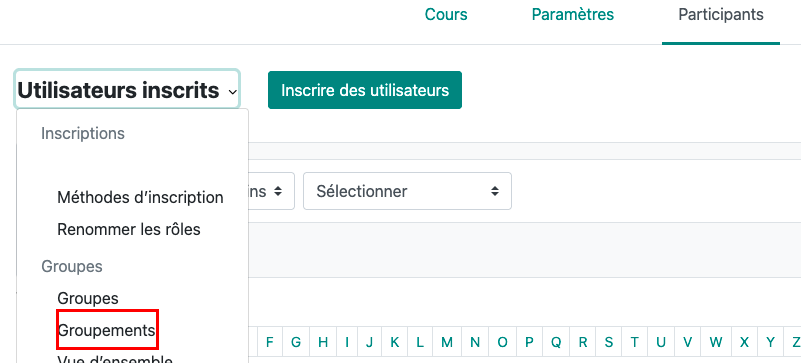
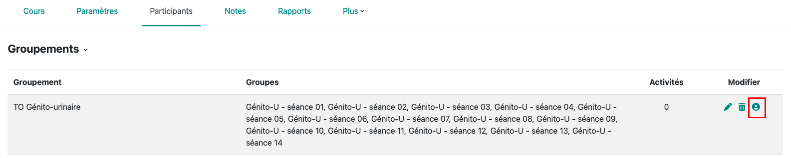
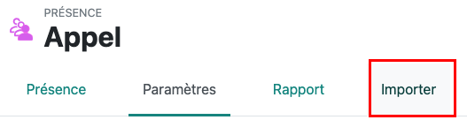

Cette note explique comment gérer les TP d'anatomie avec Célene/Moodle
L'objectif est : 

* que les étudiants s'inscrivent dans des groupes comme ils le souhaitent ; ils peuvent échanger entre aux sans intervention des enseignants.
* que les étudiants valident leur présence en flashant un QR code rotatif (pas besoin de feuille d'appel)
* que la feuille de présence soit générée automatiquement.

# Gestion des groupes
## Préparation des groupes (à faire une fois pour toutes)
### Créez un groupe d'étudiants par séance de TP :

Dans *Gérer > Créer un groupe* :

* Renseigner le nom du groupe sur le modèle *Cardio - Séance O1*
* N'utilisez pas de dates sinon vous devrez changer le nom des groupes chaque année
* Ici, un pdf listant les dates par séance est fourni aux étudiant

### Regroupez les groupes en groupements

* Dans *Créer un groupement* définir son nom, par exemple *TP Cardio*

* Sur la ligne de ce groupement cliquez sur l'icone visage pour ajouter des groupes au groupement en les faisant glisser entre les deux colonnes.

### Créez une activité de type Choix de groupe (à faire une fois pour toutes)
Ajoutez cette activité dans le cours ; elle permet aux étudiants de s'inscrire à un groupe
Remplissez : 

* Le nom du choix de groupe, par exemple *Choissez vos séances de TP de Cardio*
* Publier les résultats : *Toujours afficher les résultats aux étudiants*
* Confidentialité des résultats : *Publier les résultats complets* (permet aux étudiants de trouver ceux qui peuvent échanger)
* Autoriser la modification du choix : *Oui* ; si un étudiant veut changer, il doit se désinscrire et s'inscrire dans un autre groupe dans lequel il reste des places
* Limiter le nombre de réponses : *Activer* ; indiquez ici le nombre maximum de participants par groupe
* Cliquez *Appliquez à tous les groupes*

Dans *Groupes* ajouter le groupement correspondant à ce TP, par exemple *TP Cardio*

Enregistrez
## Pour voir les étudiants inscrits à une séance

* afficher la liste des participants et filtrez sur le nom du groupe

# Préparation de l'appel 
L'appel utlise une activité *Présence* qui doit être ajoutée au cours
## Paramétrage manuel de Présence

* Donner un nom à l'activité, par exemple *Appel*
L'onglet *Présence* liste les séances. Vous pouvez ajouter une session : 

* Type : Groupe d'étudiant : associer un groupe à cette session 
* Entrez la date et les heures de debut et de fin
* Saisie par étudiant : cocher *Permettre aux étudiants de renseigner eux même leur présence*
* Ouverture anticipée : permet aux étudiants de valider leur présence avant le début de la séance pour ne pas perdre de temps ; par exemple 10 minutes
* Cochez *Code QR rotatif* (un nouveau code est présenté toutes les minutes) ou Code QR (fixe qui peut être imprimé)
* Cliquez *Ajouter*
## Import des sessions (à faire chaque année)
La procédure décrite ci-dessus n'est pas utilisable si de nombreuses sessions doivent être entrées ; de plus il faut changer les dates chaque année.
Il est possible d'importer les séances via un fichier csv 

### Préparation du fichier csv 

|Groupes | Date | De	| à | Description |	Aucun |	Aucun	| Aucun	| autoinsc	|Aucun	|Aucun	|Aucun|Aucun	|Aucun	|Aucun	|Aucun	|Aucun	|Aucun	|Aucun	|Aucun	|Code QR rotatif|	préouverture|
------- | ---- | ---	| --- | --- |--- |	---	| ---	| ---	|---	|---	|---|---	|---	|---	|---	|---	|---	|---	|---	|---|	---
|Génito-U - séance 01	|23-03-2026	|09:00|	10:00|	TP génito urinaire | | | |1 ||||||||||||1	|600|
|Génito-U - séance 02	|23-03-2026	|10:00|	11:00|	TP génito urinaire| | | |1 ||||||||||||1	|600|

* Groupe : groupe attaché à cette session
* Date : date de la session
* De : début de la session
* à : fin de la session
* Description : champ libre décrivant la session
* Autoinsc : permet à l'étudiant de s'auto inscrire
* Code QR Rotatif : 1 ajoute le code QR
* préouverture en secondes
* Aucun : paramètres non utilisés ; ces colonnes peuvent être supprimées mais leur présence failite les imports à l'étape suivante

Sauvegardez avec un délimiteur ; (utilisez libre office plutot que excell)

### Import du ficher csv
 Dans l'activité présence, allez à l'onglet Importer

Choisir le fichier que vous venez de créer et IMPORTER

Si vous avez entré les colonnes vides dans le fichier, la correspondance entre les valeurs attendues et les noms de champs dans le fichier doit être correcte.

Confirmer ; les sénaces sont crées.

# Faire l'appel (à chaque séance)
## Le jour de la séance : 

* allez dans l'activité présence du cours > onglet Présence
* pour la séance du jour, cliquez sur la flèche "play"
* un tableau de bord s'affiche avec les étudiants attendus
* si besoin vous pouvez les noter présents absents ou excusés

## auto inscription
* cliquez sur afficher le code QR
* Les étudiants flashent le code, s'identifient sur celene ce qui valide leur présence

l'inscription n'est possible que : 
- si l'heure de la séance est correcte
- si l'étudiant fait partie du groupe attaché à la séance

## apres la séance
*cliquez sur la fleche verte qui remplace le bouton PLAY
vous obtenez le tableau des présents

